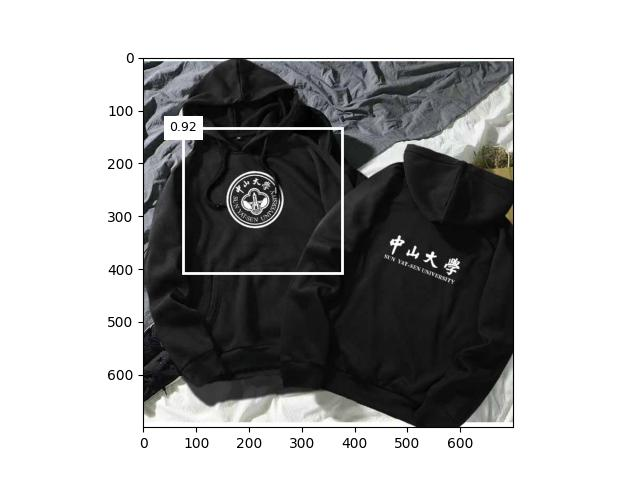

# Tiny SSD: A Tiny Single-shot Detection Deep Convolutional Neural Network for Real-time Embedded Object Detection

This repo contains the code, data and trained models for the paper [Tiny SSD: A Tiny Single-shot Detection Deep Convolutional Neural Network for Real-time Embedded Object Detection](https://arxiv.org/pdf/1802.06488.pdf).

## Quick Links

- [ Overview](#Overview)
- [ Requirements](#Requirements)
- [How to Install](#How-to-Install)
- [Description of Codes](#Description-of-Codes)
- [ Preprocessing](#Preprocessing)
  - [Preprocessed Data](#Preprocessed-Data)
- [How to Run](#How-to-Run)
  - [ Train](#Train)
    - [Finetuning from an existing checkpoint](#Finetuning-from-an-existing-checkpoint)
  - [ Evaluate](#Evaluate)
- [Results, Outputs, Checkpoints](#Results-Outputs-Checkpoints)

## Overview

Tiny SSD is a single-shot detection deep convolutional neural network for real-time embedded object detection.
It brings together the efficieny of Fire microarchitecture introduced in **SqueezeNet** and object detection performance of **SSD (Single Shot Object Detector)**.


## Requirements

* numpy
* pandas
* matplotlib
* opencv-python
* torch
* torchvision

## How to Install

- ```shell
  conda create -n env python=3.8 -y
  conda activate env
  ```
- ```shell
  pip install -r requirements.txt
  ```

## Description of Files

```
│──main.py                 -> Run models using different models
│──README.md
│──requirements.txt
│──test.py                 -> Testing Model
│──train.py                -> Training Model
│
├─data
│  │  dataloader.py         -> dataloader and transform
│  │  __init__.py
│  │
│  └─detection
│      │  create_train.py   -> data preprocessing
│      │
│      ├─background
│      ├─sysu_train
│      │  │  label.csv
│      │  │
│      │  └─images
│      ├─target
│      │      0.jpg
│      │      0.png
│      │      1.png
│      │
│      └─test
│              1.jpg
│              2.jpg
│
├─model
│  │  TinySSD.py             -> Definition of the model
│  │  __init__.py
│  │
│  └─checkpoints             -> Trained model weights
│          net_10.pkl
│          net_20.pkl
│          net_30.pkl
│          net_40.pkl
│          net_50.pkl
│		   ....
└─utils                      -> utility functions
        anchor.py
        iou.py
        utils.py
        __init__.py
```

## Preprocessing

We use /data/detection/background to generate the target detection dataset for our experiments.

Since the generated data is stored in the repository, there is no need to run this step.

### Preprocessed Data

```shell
cd data/detection/
python data/detection/create_train.py
```

## How to Run

### Train

```shell
python main.py --mode=train --batch_size=256 --epochs=100
```

The checkpoints will be saved in a subfolder of `./model/checkpoints/`.

#### Finetuning from an existing checkpoint

```shell
python main.py --mode=train --batch_size=256 --epochs=100 --path=[model path]
```

model path should be a subdirectory in the `./model/checkpoints/` directory, e.g. `--path=./model/checkpoints/net_100.pkl`

### Evaluate

```python
python main.py --mode=test --threshold=0.3 --path=./model/checkpoints/net_100.pkl
```

## Results, Outputs, Checkpoints

the ./model/checkpoints/net_100.pkl：class err 2.14e-03, bbox mae 3.32e-03



I used the following methods to improve performance：

1. HD anti-white detection object to adapt to the test image

   
2. Flip and rotate images, etc. to improve generalization performance

   
3. soft_nms

   
4. smooth_L1

   
